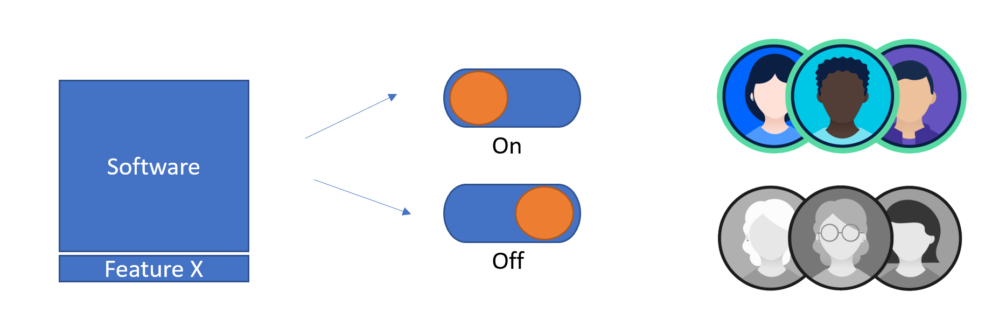

# Feature Management

Your DevOps team wants to deliver business value as often and as fast as possible. Ideally you want to release a new feature whenever it seems ready. With feature flags your can achieve this selective releasing. But how do you do this in a structural and maintainable way. We will try to explain that in this article.

## Feature Flags
Feature flags are very simple. In essence they are just blocks of code/functionality wrapped in a if/else block. Then there is usually some sort of management interface that allows enabling and disabling that certain if/else block. That way you can enabling or disable functionality at the moment you choose. This moment is completely separate of the actually deployment of the software. So now you can move new versions of your software to production continually and activated new functionality at a moment of your choosing.

## Types of feature flags

## Scenarios

## Implementing feature flags in .net core
So, how would you implement feature flags in .net core just to get started with feature flags. Luckily Microsoft has been working on a new NuGet package that lets you easily add feature flag functionality to your code. The package is call [Microsoft.FeatureManagement](https://github.com/microsoft/FeatureManagement-Dotnet)

